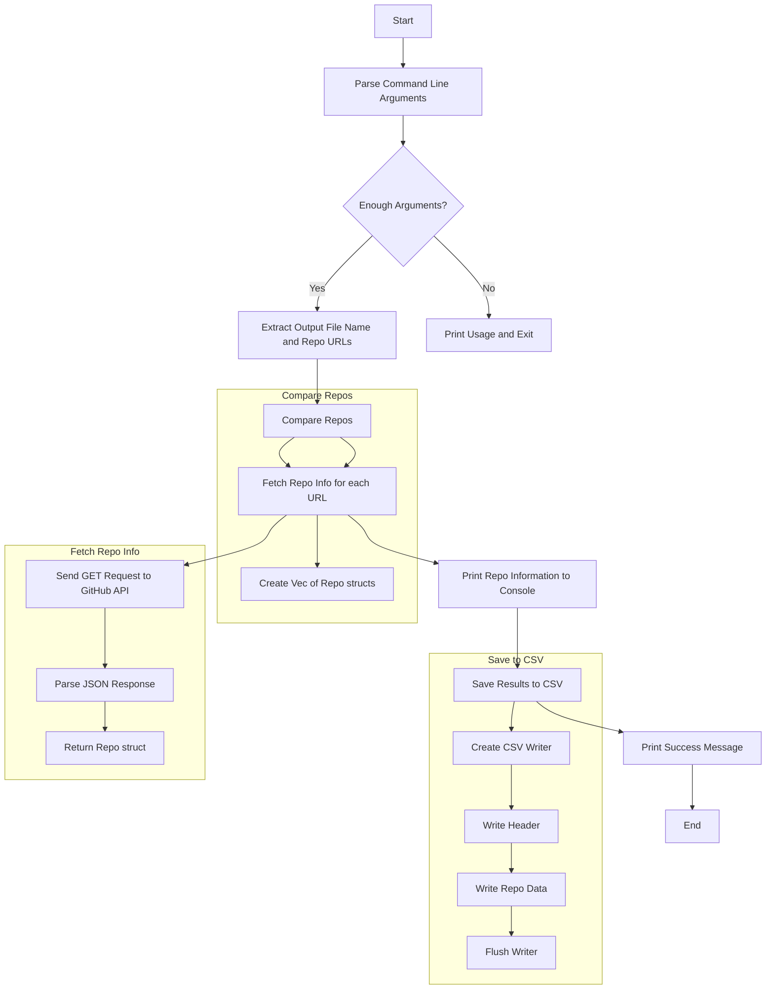

```mermaid
graph TD
    A[Start] --> B[Parse Command Line Arguments]
    B --> C{Enough Arguments?}
    C -->|No| D[Print Usage and Exit]
    C -->|Yes| E[Extract Output File Name and Repo URLs]
    E --> F[Compare Repos]
    F --> G[Fetch Repo Info for each URL]
    G --> H[Print Repo Information to Console]
    H --> I[Save Results to CSV]
    I --> J[Print Success Message]
    J --> K[End]

    subgraph Compare Repos
    F --> G
    G --> L[Create Vec of Repo structs]
    end

    subgraph Fetch Repo Info
    G --> M[Send GET Request to GitHub API]
    M --> N[Parse JSON Response]
    N --> O[Return Repo struct]
    end

    subgraph Save to CSV
    I --> P[Create CSV Writer]
    P --> Q[Write Header]
    Q --> R[Write Repo Data]
    R --> S[Flush Writer]
    end
```